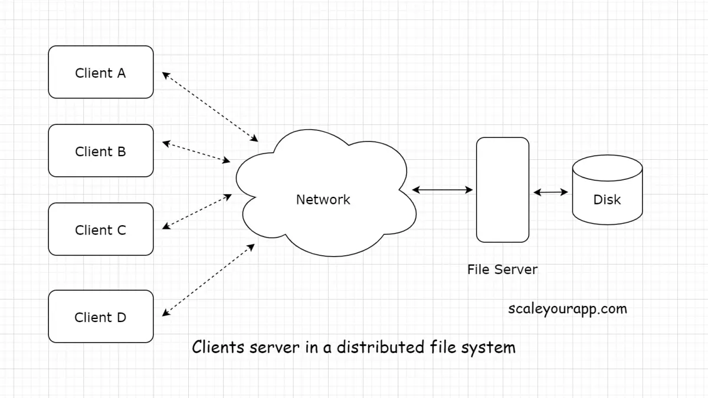

# Building a netork File System from scratch




## Basic Architecture

### Components of the System:
1. **Clients:** Represent the systems or users requesting access to files within the network file system. They serve as the primary interface to interact with the NFS, initiating various file-related operations such as reading, writing, deleting, and more.
2. **Naming Server:** The Naming Server stands as a pivotal component in the NFS architecture. This singular instance serves as a central hub, orchestrating communication between clients and the storage servers. Its primary function is to provide clients with crucial information about the specific storage server where a requested file or folder resides. Essentially, it acts as a directory service, ensuring efficient and accurate file access.
3. **Storage Servers:** Storage Servers form the foundation of the NFS. These servers are responsible for the physical storage and retrieval of files and folders. They manage data persistence and distribution across the network, ensuring that files are stored securely and efficiently.

### Operations conducted by the system:
1. **Writing a File/Folder**: Clients can actively create and update the content of files and folders within the NFS. This operation encompasses the storage and modification of data, ensuring that the NFS remains a dynamic repository.
2. **Reading a File:** Reading operations empower clients to retrieve the contents of files stored within the NFS. This fundamental operation grants clients access to the information they seek.
3. **Deleting a File/Folder:** Clients retain the ability to remove files and folders from the network file system when they are no longer needed, contributing to efficient space management.
4. **Creating a File/Folder:** The NFS allows clients to generate new files and folders, facilitating the expansion and organization of the file system. This operation involves the allocation of storage space and the initialization of metadata for the newly created entities.
5. **Listing All Files and Folders in a Folder:** Navigating the NFS structure becomes effortless for clients as they can retrieve comprehensive listings of files and subfolders within a specified directory. This feature aids in efficient file system exploration and management.
6. **Getting Additional Information:** Clients can access a wealth of supplementary information about specific files. This includes details such as file size, access rights, timestamps, and other metadata, providing clients with comprehensive insights into the files they interact with.

## How to run the code:
#### To run the Naming Server:
```bash
$ make all
$ ./nm
```
#### To run the Storage Server:
```bash
$ ./s
```
#### To run the Client:
```bash
$ ./c
```
#### To clean the codebase:
```bash
$ make clean
```

## Specifications:
### 1. Initialization of the Naming Server and Storage Server
- **Initialize the Naming Server (NM):** The first step is to initialize the Naming Server, which serves as the central coordination point in the NFS. It is responsible for managing the directory structure and maintaining essential information about file locations.
- **Initialize Storage Server 1 (SS_1):** Each Storage Server (SS) is responsible for storing files and interacting with both the Naming Server and clients. Initialization of SS_1 involves several sub-steps:
- Upon initialization, SS_1 sends vital details about its existence to the Naming Server. This information includes:
```C
    typedef struct StorageServer
    {
        char ip[IP_LEN]; // stores the ip address of the Storage Server
        int naming_port; // stores the port number which connects with the naming server.
        int client_port; // the port with which the client connects to the storage server
        char accessible_paths[MAX_ACC_PATHS][PATH_MAX]; // Maximum of 15 accesible paths displayed
    } StorageServer;

```

## Flow of the initialization
1. When you run `./nm` the naming server starts. The naming server will then listen from the port 8989 for any client request or storage server initialization request.
2. If it is a storage server wanting to initialize with the naming server, then it begins by passing an `"s"` token. But if its a client requesting to pair with the naming server, it passes a `"c"` token.
3. On accepting the token, if it's a storage server it accepts the struct as mentioned above. and stores it in a global array.
4. If its a client connection request, a thread is created, wherein the client forms a continuous channel of commmunication.

1. When you run the `./s` executable in any directory we then convert that directory into a storage server. 
2. The storage server takes in the following input from the user:
    - The port required for naming server connection
    - The port required for client connection
    - The files in the current directory are displayed as indexed paths
    - the user can chose atmost 15 paths based on the index given as the input
    - These 15 or less paths make up the list of accessible paths.
3. This is packages and sent to the naming server for it to store

A storage server can be added at any point in the running of the naming server. hence we have a port dedicated to just listening for either a new storage server initialization or a new client server request

## Operations:
### Commands issued by the naming server:

- **Create an Empty File/Directory:**
The Naming Server can instruct a Storage Server to create an empty file or directory, initiating the storage of new data.
- **Delete a File/Directory:** Storage Servers can receive commands to delete files or directories, thereby freeing up storage space and maintaining data consistency.
- **Copy Files/Directories:** Storage Servers can copy files or directories from other Storage Servers, with the NM providing the relevant IP addresses for efficient data transfer.

### Commands which can be completed by the client itself:
- **Read a File:** Clients can request Storage Servers to retrieve and send the content of a specific file, allowing seamless data access.
- **Write to a File:** Clients can send data to Storage Servers, which is then written to the designated file. This operation ensures data updates and modifications are correctly stored.
- **Get Size and Permissions:** Clients can query Storage Servers to retrieve essential file information such as size and access permissions, aiding in file management.

## Flow for each of the commands:

### 1. CREATE:
The `CREATE` command has the ability to create a new file or directory in any of the storage servers
#### SYNTAX:
```bash
command: CREATE <PATH> <FILENAME>
```

#### CONDITIONS:
- A <NAME> given in the command will be considered a file only if there exists a "." (period) in between the name.
- All other <NAME>'s are considered directories.
- The paths are unique in a SS.

#### FLOW:
- The client sends in a command to the naming server.
- The naming server then processes the Command, realizes its a naming server issued command.
- The naming server then directs the command to the storage server
- The storage server then does the needful.
- On successful implementation of the command, the Storage server returns a positive acknowledgment, which is then directed to the Client which outputs out an `"ACK"`.
- If the operation fails, a `FAIL` token is passed to the client. 

#### COMMAND IMPLEMENTATION:
- The Naming server looks for the path from all the accessible paths in each of the storage servers. 
- Once found that particular SS is contacted by the NM (naming server) with the command. 
- We then run execvp() with the `mkdir` and `touch` terminal commands.
- once created the path of the new file/dir is added to the list of accessible paths for that SS.

### 2. DELETE:
The `DELETE` command has the ability to delete any folder or directory from any of the storage servers.

#### SYNTAX:
```bash
command: DELETE <FILE/DIR_PATH>
```

#### CONDITIONS:
- The full path to the file/dir is to be provided.
- The paths are unique in each SS

#### FLOW & IMPLEMENTATION:
- The flow and implementation are almost similar
- However, here with execvp() we use `rm` for files and `rm -rf` for directories.
- Once deleted the file/dir path is deleted from that SS's accessible paths array.

### 3. COPY:
The `COPY` command has the ability to copy the contents of one file or one directory to another in another server.

#### SYNTAX:
```bash
command: COPY <PATH> <NEW_PATH>
```

#### CONDITIONS:
- Each path must exist in any one of the running storage servers.
- unique paths

#### FLOW:
- The naming server takes up both the path arguments, searches for them efficiently.
- Identifies the `TO` SS and the `FROM` SS.
- 2 sockets are created to communicate with the SS's.
- The `FROM` Storage server passes the filename to the naming server which then passes it on to the `TO` Storage Server.
- The data is then sent from one file to the other in chuncks over the network until a special string `STOP` packet is recieved. 
- Once the `STOP` packet is recieved, acknowledgements from both the servers are obtained.
- If both have positive acknowledgments then the operation is said to be successful.

### 4. READ:
The `READ` command has the ability to retrieve and read files from the Storage servers allowing data access.

#### SYNTAX:
```bash
command: READ <PATH>
```

#### FLOW:
- This is a command that is to be issued from the client itself.
- The client sends the command to the naming server.
- The NM then searches for the path from among all the SS's accessible paths. 
- The SS port and ip address is passed on to the client, using which it connects to the SS.
- The SS allows the read functionality.
- Returns positive acknowledgments if success, else, fail.

#### IMPLEMENTATION:
- Done using the implementation of the `Readers & Writers problem`
##### ON THE STORAGE SERVER END:
- A reader count is maintained which ensures that no file can be written to when someone is reading.
- Opens a file for reading, sends its contents in chunks until the entire file is sent. An acknowledgment is recieved after every chunk transfer.
- A `STOP` packet is sent once the entire file is sent.
- Now the file is open for writing.
##### ON THE CLIENT END:
- Recieves packets continously in chunks.
- sends acknowledgment on recieveing these chunks.

### 5. WRITE:
The `WRITE` command has the ability to write the contents of one file into another.

#### SYNTAX:
```bash
command: WRITE <PATH>
```

#### FLOW:
The flow and transfer of the command is similar to the READ function as it is a client abled functionality

#### IMPLEMENTATION:
- The server-side code uses threads to handle concurrent read and write operations.
- Semaphores are employed to control access to shared resources (files) and synchronize threads.
- The client-side code interacts with the user, reads a file, and transfers it to the storage server in chunks.
- The server-side code receives the data, writes it to a file, and acknowledges each chunk.
- The process continues until a "STOP" packet is received, indicating the end of the file transfer.
- Semaphores ensure proper synchronization and access control during file read and write operations on the server.

### 6. DETAILS:
the `DETAILS` command has the ability to display the file permissions and size details of a file to the outside.

#### SYNTAX:
```bash
command: DETAILS <PATH>
```
#### FLOW:
The flow and transfer of the command is similar to the READ function as it is a client abled functionality

#### IMPLEMENTATION:
- The client interacts with the storage server to receive and print file details.
- The naming server is involved in sending and receiving files.
- Threads are used for non-blocking operations.
- The client and naming server exchange data in chunks, acknowledging each chunk until a "STOP" packet is received, indicating the end of the file transfer.
- The client and naming server sockets are closed after the operations are completed.

## LRU Caching
Implemented LRU (Least Recently Used) caching for recent searches. By caching recently accessed information, the NM can expedite subsequent requests for the same data, further improving response times and system efficiency.

#### IMPLEMENTATION:
- The code uses a hashmap to store key-value pairs, where the key is a formatted string containing information about the original key (path). This formatted key includes details like the length, the last character, and the key itself. The hashmap is employed for efficient lookups and retrieval of values based on these modified keys.
- The `LRU cache` employs a doubly linked list to maintain the order of recently used items. Nodes in the list represent key-value pairs. The list includes sentinel nodes (head and tail) for ease of manipulation. When a key is accessed or a new item is added, the corresponding node is moved to the front of the list to mark it as the most recently used, ensuring efficient access.
- The `get_LRU `function retrieves the value associated with a given key from the LRU cache. If the key is found, it updates the order of nodes in the linked list to mark it as recently used, ensuring it remains at the front. The `put_LRU `function adds a new key-value pair to the LRU cache. If the cache is at its capacity, it removes the least recently used item by evicting it from both the linked list and the hashmap before adding the new item. This mechanism maintains the cache size and ensures efficient handling of new entries.

